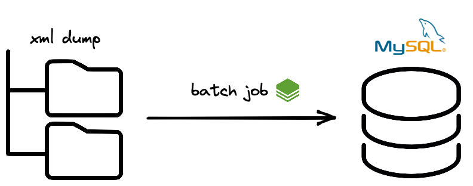

The [first post in this series](https://s11a.com/building-a-batch-pipeline-01-crash-course-in-spring-batch) went over some fundamental concepts and interfaces we will encounter as developers using Spring Batch. Now, let's build on those ideas to construct a full batch pipeline. Hopefully this can serve as a reference for how quickly a Java developer can build batch jobs.

## Prerequisites

- Spring framework
- Spring Batch fundamentals. I recommend using the last post in this series as a crash-course in tandem with [Spring's docs](https://docs.spring.io/spring-batch/docs/current/reference/html/)
- Databases i.e basic relational database concepts

The full, completed source code can be [found here](https://github.com/snimmagadda1/stack-exchange-dump-to-mysql). Below we'll construct the job piece by piece.

## The scenario

I'm sure you're aware of Stack Exchange, but did you know the people over at Stack Exchange, Inc publish all content as scheduled [data dumps](https://archive.org/details/stackexchange)? We're going to take these public records and ingest them into a relational database to demonstrate the development flow of using Spring Batch.

The job will ingest everyting in a single site on StackExchange's (posts, comments, users, etc) into a MySQL database. Using Spring Batch we can do this in an extensible manner usign a minimal amount of code.



### The datamodel

Stack Exchange publishes each site in individual archives. Luckily, they all follow [the same relational schema](https://meta.stackexchange.com/questions/2677/database-schema-documentation-for-the-public-data-dump-and-sede/2678#2678) that translates to MySQL. The datamodel for an individual site can be reduced to a few models: Posts, Comments, Users, Badges, Votes, and Post History.

The schema we'll be using to define a stack exchange site [can be found here](https://github.com/snimmagadda1/stack-exchange-dump-to-mysql/blob/master/src/main/resources/schema-base.sql).

Since we already know the full datamodel, we can use it to define all the entities as POJOs following pretty standard Spring JPA conventions. For example, the basic comments entity we'll start with looks like this:

```java
@Data
@Entity(name = "comments")
@AllArgsConstructor
@NoArgsConstructor
public class Comment {

    @Id
    private BigInteger id;
    private BigInteger postId;
    private Integer score;
    private String text;
    private String creationDate;
    private String userDisplayName;
    private BigInteger userId;
    private String contentLicense;
}
```

Each of the other objects follows a similar pattern, and all the models [can be found here](https://github.com/snimmagadda1/stack-exchange-dump-to-mysql/tree/master/src/main/java/com/snimma1/model). With entity definitions in hand, we can work on mapping inputs and outputs to them.

### Setting up the project & reading data

A starting point for many batch jobs is the delivery of a file. In this exercise, the job will read XML files in a target directory. To set that up, we can download our input data from [here](https://archive.org/details/stackexchange).

I started with a fresh clone of the [spring-batch-rapid-starter](https://github.com/snimmagadda1/spring-batch-rapid-starter.git) project. It comes with some basic datasource configurations and an opinionated organization of a Spring Batch project. I downloaded and extracted the dataset to the resources folder to get a clean template for the batch job. I chose to download the dump from [health.stackexchange.com](https://medicalsciences.stackexchange.com):

```bash
src/main/resources
├── application.yaml
├── import
│   └── health.stackexchange.com
│       ├── Badges.xml
│       ├── Comments.xml
│       ├── PostHistory.xml
│       ├── PostLinks.xml
│       ├── Posts.xml
│       ├── Tags.xml
│       ├── Users.xml
│       └── Votes.xml
```

> <small> For the sake of brevity we won't unzip the dump with code; however, it could be done in a Tasklet. In fact, there are some great examples of doing so like the one I found in [Spring Batch Toolkit](https://github.com/arey/spring-batch-toolkit#spring-batch-toolkit). </small>

The template project comes pre-wired with configuration in `application.yaml` and the package `com.batch.config.db` that the batch framework needs. Behind the scenes Spring Batch logs metadata and job output to a database. To keep things simple we'll point the framework to log to an in-memory Hyper SQL database:

```yaml
spring:
  cloud:
    task:
      initialize-enabled: true
      batch:
        fail-on-job-failure: true
  batch:
    initialize-schema: always
  datasource:
    driver-class-name: org.hsqldb.jdbc.JDBCDriver
    url: "jdbc:hsqldb:mem:testdb;DB_CLOSE_DELAY=-1"
    username: "user"
    password: "pass"
```

Out of the box there are some sample readers and writes in the package `com.batch.config.readers` for testing that aren't needed, so clear those out. With a blank project, let's work on reading and printing the data we've downloaded.

Spring Batch and the community have written many readers and writers for common use cases. For reading XML, the `StaxEventItemReader` meets our requirements. As the docs describe:

> The StaxEventItemReader configuration provides a typical setup for the processing of records from an XML input stream.

In our scenario, XML 'records' we are targeting are all in a similar form. The first few rows in posts.xml look like this:

```xml
<?xml version="1.0" encoding="utf-8"?>
<posts>
  <row Id="2" PostTypeId="1" AcceptedAnswerId="14" CreationDate="2015-03-31T19:00:01.793" Score="41" ViewCount="40838" Body="&lt;p&gt;The following tooth cracks are noticeable when a torch is shining on them (without the torch, they aren't visible).  Are they serious?  How viable are the teeth, and might they need to be replaced with false teeth in the near future?  There is no pain experienced, but they seem to look quite bad:&lt;/p&gt;&#xA;&#xA;&lt;p&gt;&lt;img src=&quot;https://i.stack.imgur.com/2sgis.jpg&quot; alt=&quot;Teeth 1&quot;&gt;&#xA;&lt;img src=&quot;https://i.stack.imgur.com/k3R8j.jpg&quot; alt=&quot;Teeth 2&quot;&gt;&lt;/p&gt;&#xA;" OwnerUserId="8" LastEditorUserId="8" LastEditDate="2015-03-31T19:33:14.567" LastActivityDate="2019-12-22T04:22:54.330" Title="What are these lines in teeth?" Tags="&lt;dentistry&gt;" AnswerCount="1" CommentCount="1" FavoriteCount="3" ContentLicense="CC BY-SA 3.0" />
  <row Id="3" PostTypeId="1" CreationDate="2015-03-31T19:06:32.503" Score="14" ViewCount="211" Body="&lt;p&gt;(By 'fortified', I refer to this definition: &lt;a href=&quot;http://www.oxforddictionaries.com/definition/english/fortify?q=fortified&quot; rel=&quot;nofollow noreferrer&quot;&gt;increase the nutritive value of (food) by adding vitamins&lt;/a&gt;.)&lt;/p&gt;&#xA;&#xA;&lt;p&gt;Are there any differences between calcium supplements (as pills or tablets), and foods fortified with calcium (e.g., artificially added to products such as soy milk)? &lt;/p&gt;&#xA;&#xA;&lt;p&gt;Isn't the solid calcium carbonate in supplements chemically the same as aqueous calcium carbonate in fortified drinks? I'm lactose-intolerant. Alas, purely natural foods don't contain enough calcium for the Recommended Daily Intake. &lt;/p&gt;&#xA;&#xA;&lt;hr&gt;&#xA;&#xA;&lt;p&gt;&lt;strong&gt;Optional Reading and Addendum:&lt;/strong&gt; &lt;/p&gt;&#xA;&#xA;&lt;blockquote&gt;&#xA;  &lt;p&gt;&lt;a href=&quot;http://www.webmd.com/osteoporosis/features/calcium-supplements-pills?page=2&quot; rel=&quot;nofollow noreferrer&quot;&gt;1. WebMD&lt;/a&gt;: &quot;Keep in mind that there's really not that much difference between getting calcium in a supplement and calcium in food.&quot;&lt;br&gt;&#xA;  &quot;Calcium-fortified foods -- such as cereals, some juices, and soy milk -- are excellent sources of the mineral, experts tell WebMD.&quot;&lt;/p&gt;&#xA;  &#xA;  &lt;p&gt;&lt;a href=&quot;http://www.health.harvard.edu/blog/high-calcium-intake-from-supplements-linked-to-heart-disease-in-men-2013020658610&quot; rel=&quot;nofollow noreferrer&quot;&gt;2. health.harvard.edu&lt;/a&gt;: An 8-ounce portion of off-the-shelf orange juice contains about 300 mg of calcium. The calcium in fortified soy milk also compares favorably to whole milk.&#xA;  Breakfast cereals (which are also fortified) contain substantial amounts of calcium, especially when combined with low-fat milk.&#xA;  A portion of oatmeal on its own contains just 100 mg of calcium. “But if you cut up some dried figs and add it to a bowl of oatmeal with milk, you easily get about half of what you need without having any supplements,” Dr. Hauser says.&lt;/p&gt;&#xA;  &#xA;  &lt;p&gt;&lt;a href=&quot;http://well.blogs.nytimes.com/2013/04/08/thinking-twice-about-calcium-supplements-2/?_r=0&quot; rel=&quot;nofollow noreferrer&quot;&gt;3. NY Times Blog&lt;/a&gt;,   &lt;a href=&quot;http://www.nytimes.com/2011/01/25/health/25brody.html&quot; rel=&quot;nofollow noreferrer&quot;&gt;4. NY Times&lt;/a&gt;&lt;/p&gt;&#xA;&lt;/blockquote&gt;&#xA;&#xA;&lt;p&gt;Footnote: I originally posed this &lt;a href=&quot;https://biology.stackexchange.com/q/10429/4466&quot;&gt;at Biology SE&lt;/a&gt;. &lt;/p&gt;&#xA;" OwnerUserId="14" LastEditorUserId="-1" LastEditDate="2017-04-13T12:48:15.073" LastActivityDate="2015-04-01T00:01:10.120" Title="Calcium supplements versus &quot;fortified with calcium&quot;" Tags="&lt;nutrition&gt;" AnswerCount="1" CommentCount="0" ContentLicense="CC BY-SA 3.0" />
  <row Id="4" PostTypeId="1" CreationDate="2015-03-31T19:11:24.947" Score="32" ViewCount="911" Body="&lt;p&gt;One of the most often-cited facts about human life, compared to those of other animals, is that the main reason we live so much longer is modern medicine. Because we can treat illnesses that would previously affect lifespan, we are far more likely to live greatly extended lifespans. However, this leads to two possible (conflicting) logical conclusions:&lt;/p&gt;&#xA;&#xA;&lt;ol&gt;&#xA;&lt;li&gt;People who by chance didn't get deadly diseases before modern medicine would live as long as people today, meaning the ability for any &lt;em&gt;individual&lt;/em&gt; to survive ninety or more years, far longer than nearly all animals, is unrelated to modern medicine.&lt;/li&gt;&#xA;&lt;li&gt;Every illness one experiences weakens the body in some way, robbing it of future years. This would mean the role of modern medicine in extending lifespan is treating these illnesses to prevent the gradual reduction in lifespan.&lt;/li&gt;&#xA;&lt;/ol&gt;&#xA;&#xA;&lt;p&gt;If the first is true, then lifespan itself isn't influenced by modern medicine unless it prevents death as the direct result of a disease, and only &lt;em&gt;average&lt;/em&gt; lifespan is affected. In other words, if nine in ten dies at age thirty due to a deadly disease, and one in ten dies at age eighty by avoiding disease, the average life expectancy is thirty five, even though an individual could by living an extremely careful life survive to reach eighty.&lt;/p&gt;&#xA;&#xA;&lt;p&gt;If the second is true, then short periods of non-deadly illnesses experienced by everyone each shorten life expectancy by a tiny amount, together decreasing &lt;em&gt;everyone's&lt;/em&gt; lifespan to the same thirty five, rather than the effect being a result of averages.&lt;/p&gt;&#xA;&#xA;&lt;p&gt;&lt;strong&gt;So does each illness shorten lifespan, or is it only a result of averages that lifespan was so low pre-modern medicine, and humans always had the capacity for exceptionally-long lives?&lt;/strong&gt;&lt;/p&gt;&#xA;" OwnerUserId="11" LastActivityDate="2017-01-16T14:14:31.053" Title="If human life is so long largely due to modern medicine, does every illness shorten lifespan?" Tags="&lt;life-expectancy&gt;&lt;disease&gt;&lt;statistics&gt;" AnswerCount="2" CommentCount="3" ContentLicense="CC BY-SA 3.0" />

```

To process this, we need to configure the `StaxEventItemReader` with a minimum of:

- **Root element name**: the name of the base element with the object to be mapped. Above, each `Post` is an individual `row` element.
- **Resource**: the spring resource pointing to a file or location with files to read.
- **Unmarshaller**: A [Spring OXM](https://github.com/spring-projects/spring-framework/tree/main/spring-oxm/src/main/java/org/springframework/oxm) interface used to map an XML fragment to an object.

Specifying this information using fluent builder syntax looks like this:

```java
  @Bean
  public StaxEventItemReader postsReader() {
    Jaxb2Marshaller unmarsh = new Jaxb2Marshaller();
    unmarsh.setClassesToBeBound(Post.class);
    return new StaxEventItemReaderBuilder<Post>()
        .name("postReader")
        .resource(new FileSystemResource("src/main/resources/import/health.stackexchange.com/Posts.xml"))
        .addFragmentRootElements("row")
        .unmarshaller(unmarsh)
        .build();
  }
```

Above we create a `StaxEventItemReader` named `postReader` that operates on elements named `row` using the `Jaxb2Marshaller` (a generic marshaller/unmarshaller using the Java Architecture for XML Binding a.k.a JAXB spec). We're also binding the class `Posts` defined above to the unmarshaller instance `unmarsh`.

We need to do one more thing before reading XML, and that is annotate the POJO entities we defined with some metadata required for parsing. You'll notice the addition of a few annotations. `XmlRootElement` specifies the name of individual elements in a document and `XmlAttribute` specifies how to map to fields in the class. Lastly, `XmlAccessorType` is used to determine how to marshal to/from XML, and we specify that `XmlAccessType.FIELD` to signify that each field should be found to XML:

```java
import javax.persistence.Entity;
import javax.persistence.Id;
import javax.xml.bind.annotation.XmlAccessType;
import javax.xml.bind.annotation.XmlAccessorType;
import javax.xml.bind.annotation.XmlAttribute;
import javax.xml.bind.annotation.XmlRootElement;
import java.math.BigInteger;

@Data
@Entity(name = "badges")
@AllArgsConstructor
@NoArgsConstructor
@XmlRootElement(name = "row")
@XmlAccessorType(XmlAccessType.FIELD)
public class Badge {

    @Id
    @XmlAttribute(name = "Id")
    private BigInteger id;

    @XmlAttribute(name = "UserId")
    private BigInteger userId;

    @XmlAttribute(name = "Name")
    private String name;

    @XmlAttribute(name = "Date")
    private String date;

    @XmlAttribute(name = "Class")
    private Integer badgeClass;

    @XmlAttribute(name = "TagBased")
    private Boolean tagBased;
}
```

At this point we can use this `ItemReader` in a `Step` and start ingesting XML rows of post data backed by entities.

Before doing that, let's clean up our reader definition and parameterize some configuration info. We can extract the file name and path to Spring properties, and reference in our configuration class `ReadersConfig`. In `application.yaml` add properties pointing to the input data:

```yaml
import:
  file:
    dir: "import/health.stackexchange.com"
    posts: "Posts.xml"
    comments: "Comments.xml"
    badges: "Badges.xml"
    postHistory: "PostHistory.xml"
    users: "Users.xml"
    votes: "Votes.xml"
```

I also chose to lay the groundwork for ingesting multiple XML files of posts with a `MultiResourceItemReader`. This is totally optional, but by passing types of `ResourcePatternResolver`s to the `MultiResourceItemReader` the framework can easily read one or more directories. I set up the basis for this but am only pointing to a single file resource for now to save space. The refactored post reader definition looks like this:

```java
@Configuration
@PropertySource("classpath:application.yaml")
public class ReadersConfig {

  @Value("${import.file.dir}")
  private String dir;

  @Value("${import.file.posts}")
  private String postsFile;

  @Bean
  public ItemReader multiPostsReader() {
    Resource[] resources = null;
    Resource fileSystem = new FileSystemResource(dir + "/" + postsFile);
    resources = new Resource[] {fileSystem};
    MultiResourceItemReader<String> reader = new MultiResourceItemReader<>();
    reader.setResources(resources);
    reader.setDelegate(postsReader());
    return reader;
  }

  @Bean
  public StaxEventItemReader postsReader() {
    Jaxb2Marshaller unmarsh = new Jaxb2Marshaller();
    unmarsh.setClassesToBeBound(Post.class);
    return new StaxEventItemReaderBuilder<Post>()
        .name("postReader")
        .addFragmentRootElements("row")
        .unmarshaller(unmarsh)
        .build();
  }
}
```

Now let's print some data with this reader! I grabbed this slick `ConsoleItemWriter` from [Spring Batch Toolkit](https://github.com/arey/spring-batch-toolkit#spring-batch-toolkit) to use as the writer in a test step. It 'writes' by logging to the console.

```java
package com.snimma1.custom;

import org.apache.commons.lang3.builder.ToStringBuilder;
import org.slf4j.Logger;
import org.slf4j.LoggerFactory;
import org.springframework.batch.item.ItemWriter;

import java.util.List;

/**
 * Logs each content item by reflection with the {@link ToStringBuilder#reflectionToString(Object)}
 * method.
 *
 * @author Antoine
 * @param <T>
 */
public class ConsoleItemWriter<T> implements ItemWriter<T> {

    private static final Logger LOG = LoggerFactory.getLogger(ConsoleItemWriter.class);
s
    @Override
    public void write(List<? extends T> items) throws Exception {
        LOG.trace("Console item writer start");
        for (T item : items) {
            LOG.info(ToStringBuilder.reflectionToString(item));
        }
        LOG.trace("Console item writer end");
    }
}
```

In the class `WritersConfig` let's define a method `consoleItemWriter` to create an instance of the writer to use in a step definition.

```java
@Configuration
@PropertySource("classpath:application.yaml")
public class WritersConfig {
  @Bean
  public ConsoleItemWriter consoleItemWriter() {
    return new ConsoleItemWriter();
  }
}
```

With reader and writer instances defined, the next step is to create the `Step`. The template should have already injected `ReadersConfig` and `WritersConfig` instances for use in the class `BatchConfig`. Defining the step to read and print post XML data is relatively straightforward with fluent syntax:

```java
  @Bean
  public Step printPosts() {
    return stepBuilderFactory
        .get("posts")
        .<Post, Post>chunk(BATCH_CHUNK_SIZE)
        .reader(readers.multiPostsReader())
        .writer(writers.consoleItemWriter())
        .faultTolerant()
        .build();
  }
```

Functionally, this creates a chunk-based step with a reader that delegates work to the `StaxEventItemReader` we defined for posts and writes output to the console. Now we can define a single-step job that when started will read `Posts.xml` and log to the console. The full job configuration to print post XML looks like this:

```java
@Configuration
@EnableBatchProcessing
@EnableTask
public class BatchConfig {

  public static final int BATCH_CHUNK_SIZE = 500;

  public TaskConfigurer taskConfigurer;

  public final JobBuilderFactory jobBuilderFactory;

  public final StepBuilderFactory stepBuilderFactory;

  /** Holds all readers available for job */
  private final ReadersConfig readers;

  /** Holds all writers available for job */
  private final WritersConfig writers;

  @Autowired
  public BatchConfig(
      JobBuilderFactory jobBuilderFactory,
      StepBuilderFactory stepBuilderFactory,
      TaskConfigurer taskConfigurer,
      ReadersConfig readers,
      WritersConfig writers) {
    this.jobBuilderFactory = jobBuilderFactory;
    this.stepBuilderFactory = stepBuilderFactory;
    this.taskConfigurer = taskConfigurer;
    this.readers = readers;
    this.writers = writers;
  }

  @Bean
  public Step printPosts() {
    return stepBuilderFactory
        .get("posts")
        .<Post, Post>chunk(BATCH_CHUNK_SIZE)
        .reader(readers.multiPostsReader())
        .writer(writers.consoleItemWriter())
        .faultTolerant()
        .build();
  }

  @Bean
  public Job importStackDumpToSql(Step printPosts) {
    return jobBuilderFactory
        .get("stackDump2SQL")
        .incrementer(new RunIdIncrementer())
        .start(printPosts)
        .build();
  }
}
```

Compiling and running the job results in Posts being printed to the console in rapid succession. Success!

```bash
2022-02-09 08:01:23.653  INFO 4683 --- [main] com.snimma1.custom.ConsoleItemWriter : com.snimma1.model.Post@7cab8d52[id=5181,postType=1,acceptedAnswerId=5192,parentId=<null>,score=4,viewCount=59,body=<p>The study <a href="http://www.ncbi.nlm.nih.gov/pubmed/11697022" rel="nofollow">Preventing the common cold with a garlic supplement: a double-blind, placebo-controlled survey</a> shows a reduction of days challenged virally by about 70% just by taking 180mg allicin every day.</p>
2022-02-09 08:01:23.645  INFO 4683 --- [main] com.snimma1.custom.ConsoleItemWriter : com.snimma1.model.Post@4c5c0306[id=5130,postType=1,acceptedAnswerId=<null>,parentId=<null>,score=5,viewCount=98,body=<p>Most people would say that eating fruit is good for us; vitamins, micro-nutrients, phyto-chemicals.</p>
```

Having validated that the `StaxEventItemReader` we created works for post data, the definitions for reading the other Stack Exchange domain objects can be written with the same set of steps.
Simply define a Bean of type `StaxEventItemReader` that is bound to the POJO representing the data, and use it as the delegate in another `MultiResourceItemReader` pointing to the data on the local filesystem. The final reader definitions for posts, comments, badges, post history, users, and votes are [defined here](https://github.com/snimmagadda1/stack-exchange-dump-to-mysql).

### Connecting & writing to MySQL

If you recall, a chunk-oriented step must read from at least one input and write to at least one output. So far we've constructed wiring to read our target data from XML and write to the console. Now let's close the loop and write to a more meaningful output.

Before defining the `ItemWriter`s for the job, let's get an instance of MySQL up and running. This can be done many ways. The simplest for local development nowadays is via a container. Using docker we can start an instance of MySQL as follows:

```bash
docker run --name test-mysql -e MYSQL_ROOT_PASSWORD=password -e MYSQL_ROOT_USER=root -e MYSQL_PASSWORD=password -d -p 3306:3306 mysql:5.7.26
```

>I happen to be running apple silicon and the typical mysql image doesn't work. As a workaround I ended up using this [mysql-server image](https://hub.docker.com/r/mysql/mysql-server) without issue.

Once your instance of MySQL is running, the last setup step is to create the target database and execute the schema. I created a database `stacke` and executed [the full schema here](https://github.com/snimmagadda1/stack-exchange-dump-to-mysql/blob/master/src/main/resources/schema-base.sql) to get a set of empty tables to populate via the batch job.

With a running database and empty schema let's make the working batch application aware of it by adding an additional datasource. The rapid-starter template already has taken care of most of the boilerplate to do so. Configuring the `app.datasource` properties with our MySQL details in `application.yaml` will do the job:

```yaml
app:
  datasource:
    dialect: org.hibernate.dialect.MySQLDialect
    driver-class-name: org.mariadb.jdbc.Driver
    url: jdbc:mysql://${MYSQL_HOST:localhost}:3306/stacke
    username: ${MYSQL_USER:batch}
    password: ${MYSQL_PWD:password}
```

You may also notice the rapid-starter & package `com.batch.config.db` sets up spring-data-jpa. This will come in handy shortly... To verify succesful configuration, go ahead and start up the application. You should see some new output this time similar to below if everything worked:

```bash
2022-03-06 18:58:13.676  INFO 50201 --- [main] o.hibernate.jpa.internal.util.LogHelper: HHH000204: Processing PersistenceUnitInfo [name: appPersU]
2022-03-06 18:58:13.696  INFO 50201 --- [main] org.hibernate.Version: HHH000412: Hibernate ORM core version 5.4.25.Final
2022-03-06 18:58:13.759  INFO 50201 --- [main] o.hibernate.annotations.common.Version: HCANN000001: Hibernate Commons Annotations {5.1.2.Final}
2022-03-06 18:58:13.890  INFO 50201 --- [main] org.hibernate.dialect.Dialect: HHH000400: Using dialect: org.hibernate.dialect.MySQLDialect
2022-03-06 18:58:14.293  INFO 50201 --- [main] o.h.e.t.j.p.i.JtaPlatformInitiator: HHH000490: Using JtaPlatform implementation: [org.hibernate.engine.transaction.jta.platform.internal.NoJtaPlatform]
2022-03-06 18:58:14.297  INFO 50201 --- [main] j.LocalContainerEntityManagerFactoryBean: Initialized JPA EntityManagerFactory for persistence unit 'appPersU'
2022-03-06 18:58:14.482  INFO 50201 --- [main] o.hibernate.jpa.internal.util.LogHelper: HHH000204: Processing PersistenceUnitInfo [name: springPersU]
2022-03-06 18:58:14.502  INFO 50201 --- [main] org.hibernate.dialect.Dialect: HHH000400: Using dialect: org.hibernate.dialect.HSQLDialect
2022-03-06 18:58:14.583  INFO 50201 --- [main] o.h.e.t.j.p.i.JtaPlatformInitiator: HHH000490: Using JtaPlatform implementation: [org.hibernate.engine.transaction.jta.platform.internal.NoJtaPlatform]
2022-03-06 18:58:14.583  INFO 50201 --- [main] j.LocalContainerEntityManagerFactoryBean: Initialized JPA EntityManagerFactory for persistence unit 'springPersU'
2022-03-06 18:58:14.683  WARN 50201 --- [main] o.s.b.c.c.a.DefaultBatchConfigurer: No transaction manager was provided, using a DataSourceTransactionManager
2022-03-06 18:58:14.686  INFO 50201 --- [main] o.s.b.c.r.s.JobRepositoryFactoryBean: No database type set, using meta data indicating: HSQL
2022-03-06 18:58:14.767  INFO 50201 --- [main] o.s.b.c.l.support.SimpleJobLauncher: No TaskExecutor has been set, defaulting to synchronous executor.
2022-03-06 18:58:14.933  INFO 50201 --- [main] com.snimma1.Application: Started Application in 2.004 seconds (JVM running for 2.229)
```

To write to MySQL, we need to define `ItemWriter`s using the `Datasource` we just configured. There are a number of valid ways to do this. For example, we could write a custom `ItemWriter` by injecting the MySQl `Datasource` into our implementation3. However, doing a quick review of the Spring-supported writes we can save some time by leveraging the the `JpaItemWriter` [implementation](https://docs.spring.io/spring-batch/docs/current/api/org/springframework/batch/item/database/JpaItemWriter.html) that comes with Spring Batch. We can create a single instance of a `JpaItemWriter` with the persistance context for the `app.datasource` and use it to write each entity (i.e post, comment, etc) to MySQL. Since the rapid-starter has already setup spring-data-jpa, we just need to inject the `EntityManager` associated with `app.datasource` to create a working writer. Our complete `WritersConfig` looks like this:

```java
@Configuration
@PropertySource("classpath:application.yaml")
public class WritersConfig {
  @Bean
  public ConsoleItemWriter consoleItemWriter() {
    return new ConsoleItemWriter();
  }

  @Bean
  public JpaItemWriter jpaItemWriter(
      @Qualifier("appEntityManager") LocalContainerEntityManagerFactoryBean factory) {
    JpaItemWriterBuilder builder = new JpaItemWriterBuilder();
    return builder.entityManagerFactory(factory.getObject()).build();
  }
}
```
t