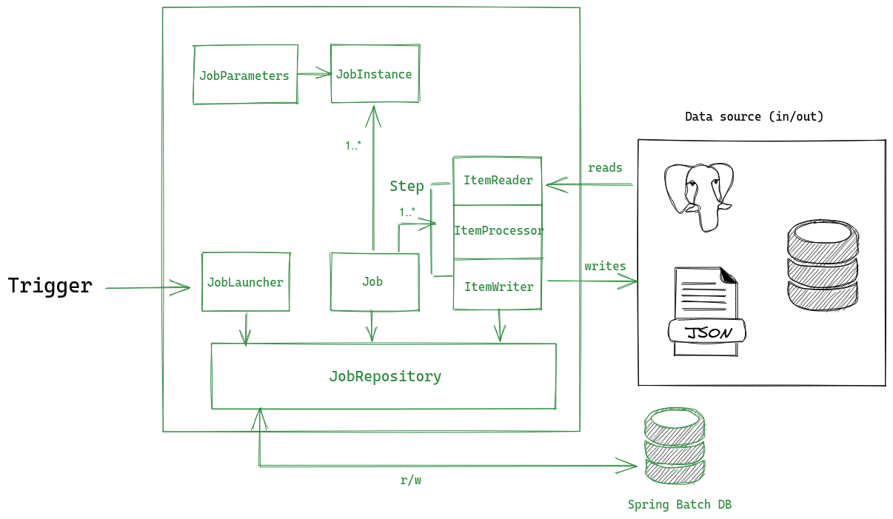
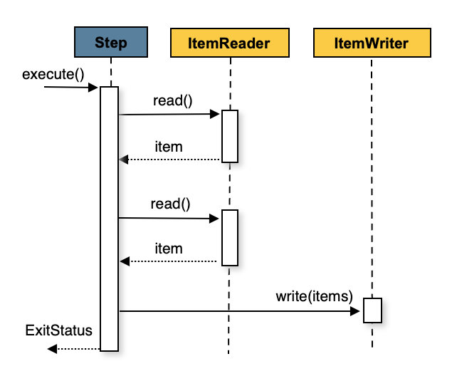

The last post took look at a Spring Batch project template to get off the ground quickly. In this series we're going to take it a step further and use the starter to build out a batch job. We won't focus too much here on the implementation of the framework itself ([docs do a good job of that](https://docs.spring.io/spring-batch/docs/4.3.x/reference/html/domain.html#domainLanguageOfBatch)), but rather practical use-cases to quickly enable yourself to build robust batch apps for enterprise apps.

## Prerequisites
You be proficient with Java for this guide. Along with that, knowledge of the following is very beneficial:
- Spring framework (IoC, beans, context, etc)
- Databases
- Docker (not required but useful for running locally)

Here we'll do a quick overview of some of the primary components that you'll work with in Spring Batch. Depending on your use case, you may want to dig around [the official docs](https://spring.io/projects/spring-batch#learn) for additional info. 

## Goals
In this set of posts we will build a modest, multi-threaded batch pipeline. It will read a directory of files (XML data dumps from Stack Exchange), perform some processing, and write to a relational DB (MySQL). Here is the link to the full source:

- [**Source**](https://github.com/snimmagadda1/stack-exchange-dump-to-mysql)

## Intro to batch processing
If you're someone looking for a refresher in the strategies and principles of batch processing, I would recommend a skim of Spring's introduction [here](https://docs.spring.io/spring-batch/docs/current/reference/html/spring-batch-intro.html#spring-batch-intro). I found this portion of their docs super helpful. It does a great job providing background on batch processing and translating that to Spring Batch's architecture.

## Understanding Spring Batch... enough to get started
Like most-things-Spring, the framework comes with a lot built for you out of the box and you can get [running pretty quickly](https://spring.io/guides/gs/batch-processing/). Adding `@EnableBatchProcessing` to your spring app gives you everything you need to code with for free (magic). Personal experience has taught me it's best to have a decent grasp on Spring's implementation of whatever you're using. We'll use the following diagram to quickly go through the way Spring implements batch and how to use some of the common interfaces.



The diagram depicts the general process flow of a Spring Batch job. In summary, any external trigger could interact with the `JobLauncher`, which is responsible for kicking off a `Job`. As jobs are triggered and run, metadata and progress is reported to a datastore via the `JobRepository`. A developer defines isolated steps that handle their own reads, processing, and writes from N inputs and outputs.

The above isn't a comprehensive architecture diagram (theres some additional classes & interfaces exposed by the framework) but it should give you a baseline of what you're working with:

### The `Job` interface
**A `Job` is the object Spring gives you to configure and declare a batch pipeline.** 

It comes with some configuration options you can tune like restartability (at the highest level), step order, etc. To define your job, you'll want to use the provided `JobBuilderFactory`. Doing so will give you access to some handy builder syntax to create simple job definitions. We can define paths of execution by chaining multiple `Step`s or `Flow`s to descrobe our batch logic:

```java
@Bean
public Job coolBatchJob() {
    return jobBuilderFactory
            .get("coolBatchJob")
            .flow(stepA())
            .end()
            .build();
}
```

In the above snippet, we're definine a job called `coolBatchJob` and kicking it off with a single step. That step is coming from a method `stepA()` that returns an object of type `Step`. 


Many batch pipelines consist of multiple steps with triggers and even conditional logic. The builder allows us to define this with ease. In the following job definition, the builder is used to define some conditionals. The pipeline runs its "happy path" of `stepA` followed by a seqence of steps in `flow1()` and `flow2()`; however, we've also defined an alternate step to run if `stepA` returns an ending status of `NOTIFY`:

```java
@Bean
public Job coolBatchJob() {
    return jobBuilderFactory
            .get("coolBatchJob")
            .start(stepA())
            .on("NOTIFY")
                .to(notification())
            .from(stepA())
            .on("COMPLETED")
                .to(flow1())
                .next(flow2())
            .end()
            .build();
}
```

&nbsp;
&nbsp;


### The `Step` interface
**A `Step` is one level lower than a Job. It represents an independent unit of work.** Spring doesn't impose too many restrictions on how a step must be implemented. A step could be as easy as reading from a file and writing to a table in a DB. A more complicated step might read a file with different entities, apply some business or filtering logic, and write the aggregate somewhere. Just like a job has a `JobExecution` object holding metadata for each run, each step is associated with a `StepExecution` recording metadata such as readCount, errorCount, and execution time.


You'll want to be familiar with the process of defining and fine tuning a step. Within the framework there are two models for steps to choose from, a *chunk-oriented* *step* or a `TaskletStep`. These two approaches are outlined below.

#### Chunky steps?
**Understanding the *chunk-oriented* processing style Spring Batch uses is essential for building steps.** In a nutshell, this means that many individual reads will occur until the count of reads equals the 'commit interval', or chunksize. At this point, the entire set of items (chunk) is written to output. If you're familiar with database operations, this is effectively reading and writing within a transaction boundary. Because it is operationally expensive to start/stop a transaction, it is preferable to process as many items as possible within each transaction. This sequence diagram from Spring's docs goes a good job illustrating the process with a diagram and psuedocode:



```java
List items = new Arraylist();
for(int i = 0; i < commitInterval; i++){
    Object item = itemReader.read();
    if (item != null) {
        items.add(item);
    }
}

List processedItems = new Arraylist();
for(Object item: items){
    Object processedItem = itemProcessor.process(item);
    if (processedItem != null) {
        processedItems.add(processedItem);
    }
}

itemWriter.write(processedItems);
```

The real power & legwork of the framework lies within this type of chunk-based approach. The type of data being processed and resources of your system should factor into the chunksize of each step. This is why the number of read/writes in each step is highly configurable.

To create a step you specify an `ItemReader` that is able to ingest the input data and an `ItemWriter` that writes to a desired output. Step definitions could optionally use an `ItemProcessor` that specifies a function to run on each item. To demonstrate how you might go about constructing a step, let's use the following scenario:

> A **Person** can be defined by a first name and last name. A step in a job needs to read hundreds of people from a CSV and write to a relational database. The names must be written to the DB in all capital letters. An excerpt of the file to read looks like this:

```
Jill,Doe
Joe,Doe
Justin,Doe
Jane,Doe
```

> The class `Person` can be modeled this way:

```java
public class Person {
    private String lastName;
    private String firstName;

    public Person(String firstName, String lastName) {
        this.firstName = firstName;
        this.lastName = lastName;
    }

    @Override
    public String toString() {
        return "firstName: " + firstName + ", lastName: " + lastName;
    }
}
```
In this scenario we have to read from a CSV, do some capitalization (processing), and insert rows to a SQL table. Just like with jobs, there's a builder available for configuring the read, processing, and write behavior of a *chunk-oriented* step. Here we define a `Step` with name `personStep` and chunk size of 100, meaning 100 names will be read then committed in aggregate.


```java
@Bean
public Step step1() {
    return stepBuilderFactory
            .get("personStep")
            .<Person, Person>chunk(100)
            .reader(readers.readerCsv())
            .processor(processor())
            .writer(writers.csvItemWriter())
            .build();
}
```

We also pass to the builder an `ItemReader` and `ItemWriter` that direct the read/write behavior of the step (these will be explained in a bit more detail later). [Spring and the community already provide many different types of readers and writers](https://docs.spring.io/spring-batch/docs/4.3.x/reference/html/appendix.html#listOfReadersAndWriters) so writing a full-fledged batch pipeline could take very little code. [Readers](https://docs.spring.io/spring-batch/docs/current/api/org/springframework/batch/item/ItemReader.html#read--) and [writers](https://docs.spring.io/spring-batch/docs/current/api/org/springframework/batch/item/ItemWriter.html) are very simple interfaces so building a custom reader/writer is as easy as defining a single method. 

We won't look too deeply into the process of defining `ItemReader`s and `ItemWriter`s here because the syntax of each is largely specific to the implementation. For completeness, here's the reader and writer definitions for this scenario:

```java
/** @return FlatFileItemReader Configured reader 
* uses framework's FlatFileItemReader
*/
@Bean
public FlatFileItemReader<Person> readerCsv() {
    FlatFileItemReader<Person> reader = new FlatFileItemReader<Person>();
    reader.setResource(new ClassPathResource(csvFile));
    reader.setLineMapper(
            new DefaultLineMapper<Person>() {
                {
                    setLineTokenizer(
                            new DelimitedLineTokenizer() {
                                {
                                    setNames(new String[] {"firstName", "lastName"});
                                }
                            });
                    setFieldSetMapper(
                            new BeanWrapperFieldSetMapper<Person>() {
                                {
                                    setTargetType(Person.class);
                                }
                            });
                }
            });
    return reader;
}

/*
Uses framework's JdbcBatchItemWriter
*/
@Bean
public JdbcBatchItemWriter<Person> jdbcWriter() {
    JdbcBatchItemWriter<Person> writer = new JdbcBatchItemWriter<Person>();
    writer.setItemSqlParameterSourceProvider(new BeanPropertyItemSqlParameterSourceProvider<Person>());
    writer.setSql("INSERT INTO people (first, last) VALUES (:first, :last)");
    writer.setDataSource(dsDestino);
    
    return writer;
}
```

The builder also exposes a number of options for fault tolerance, skipping, multi-threading, retry logic, and others.

&nbsp;

#### Tasklet steps
A *TaskletStep* is a bit simpler than a *chunk-oriented* step. It is best used in steps of a pipeline that don't fit into the chunk-based mold i.e calling a stored procedure or executing some DDL statements. The syntax for defining a `TaskletStep` is much simpler:

```java
@Bean
public Step step1() {
    return this.stepBuilderFactory.get("step1")
    			.tasklet(myTasklet())
    			.build();
}
```

You simply define a class that implements the `Tasklet` interface. This class has a single method, `execute`, that is called repeatedly until returning `RepeateStatus.FINISHED`. A common pattern in the early/late steps of a job is to run some DDL to instantiate a schema before writing. This could be done by creating a `Tasklet`:

```java
```
