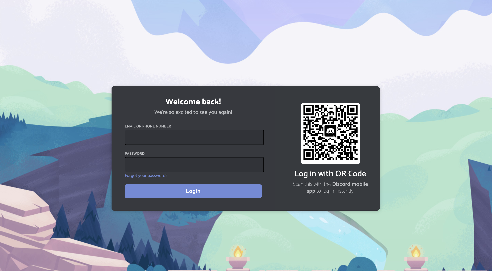

## [styled-components](https://styled-components.com/) 

I've been eyeing [styled-components](https://styled-components.com/) for a while now, so I decided to throw together a clone of the Discord login form to get a feel for developing with the library. Here's my current progresss - it's responsive, but missing some key elements like the cool SVG animation of the background:


<p style="text-align: center; font-weight: 800; font-style:italic">
<a href="https://bit.dev/snimmagadda1/discord-login-form/discord-form">Live component here on bit.dev!</a>
</p>


After throwing this together, I gotta say I enjoyed flow of using styled-components. I know it's just CSS in JS, but it *feels* slick. Using it completely removed any worry of conflicting class names / styles and I also really enjoyed the way props work. I personally find coding logic to determine styles in render methods tedious. But with styled-components the coupling of logic and styles is closer than ever. Take this simple usage of props. By passing in the prop `primary` to the `GamerForm` we are able to influence its style:

```css
/* GamerForm.js */
import styled from 'styled-components';

const GamerForm = styled.form`
  background-color: ${props => props.primary ? "#36393f" : "papayawhip"};
  border-radius: 8px;
  padding: 32px;
  display: flex;
  flex-direction: column;
  min-width: 414px;

  ....
```

```jsx{7}
// DiscordForm.js
class DiscordForm extends React.Component {
  render() {
    return (
      <ThemeProvider theme={theme}>
        <Container>
          <GamerForm primary>
            <fieldset>
              <h3>Welcome back!</h3>
              <h4>We're so excited to see you again!</h4>
              <GamerInput>
                <label htmlFor="ephone">EMAIL OR PHONE NUMBER</label>
                <input type="text" name="ephone" id="ephone"></input>
              </GamerInput>
              <GamerInput>
                <label htmlFor="password">PASSWORD</label>
                <input type="password" name="password" id="password"></input>
                <a>Forgot your password?</a>
              </GamerInput>
              <button type="submit">
                <div>Login</div>
              </button>
            </fieldset>
          </GamerForm>

          ....
```

Theming is another neat tool that comes in styled components that has parallels in things like SASS. By wrapping styled-components in  a `<ThemeProvider>` component and passing in an object like the following you can build re-usable and dynamically themed sites:

```css
const theme = {
  colors: {
    muted: "#B9BBBE",
    blue: "#7289da",
  },
};
```

I'll be using this at least for the next few months. 