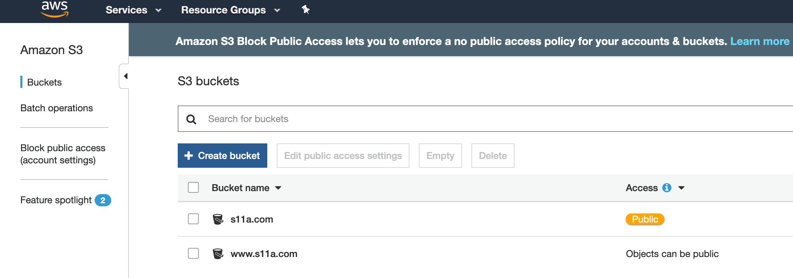
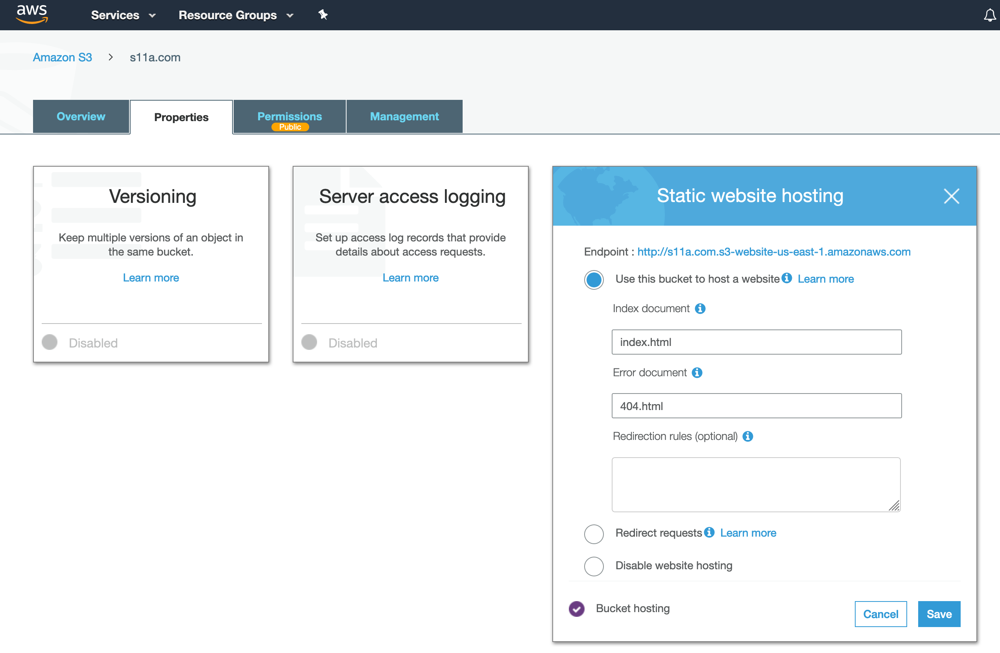
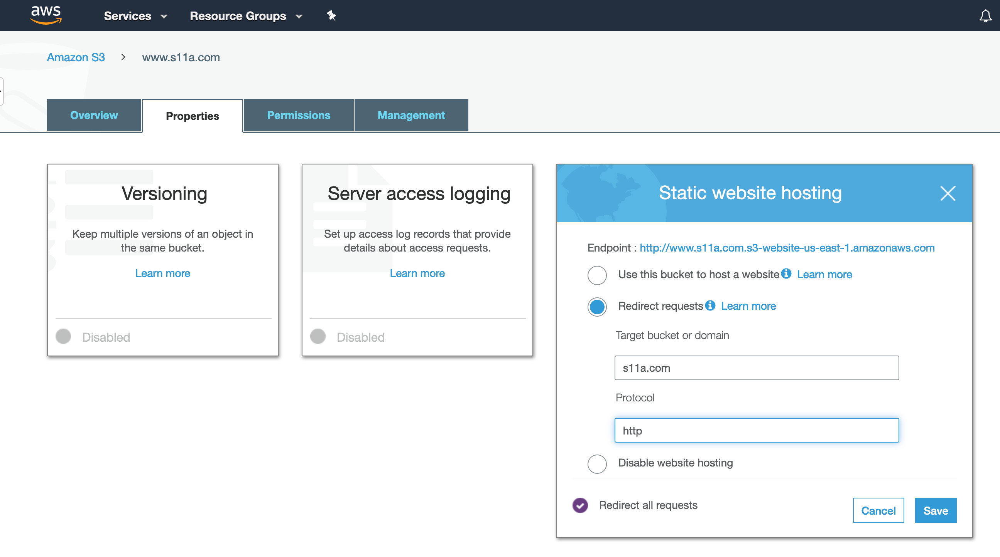
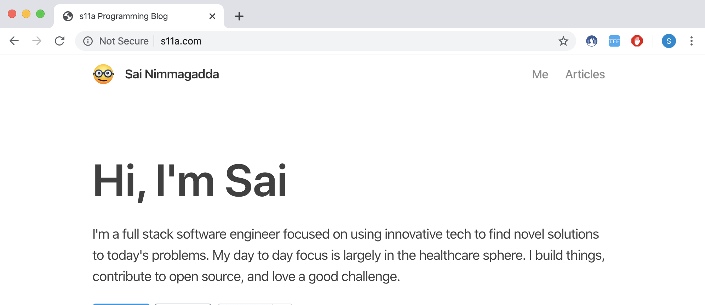
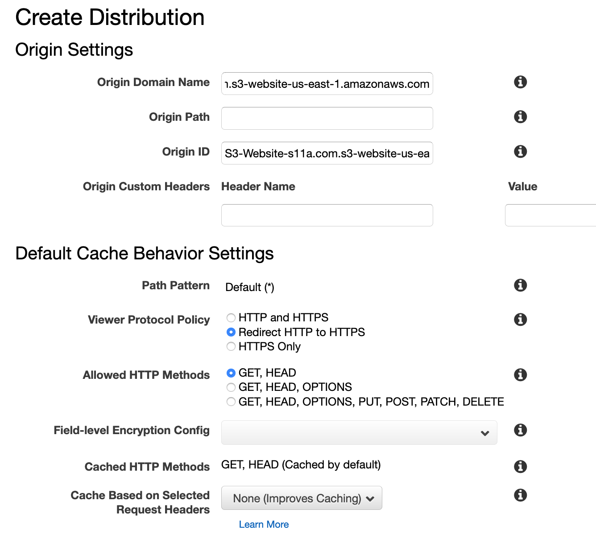
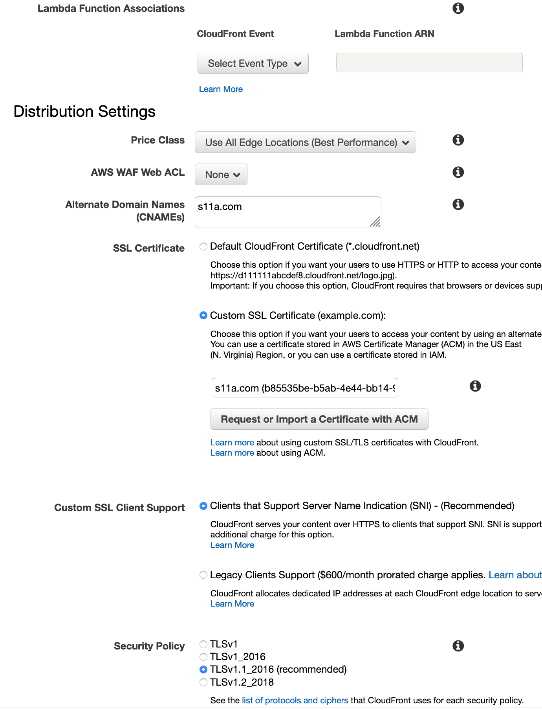

I recently migrated this site's hosting to AWS and was pleasantly surprised to find that you can host a static, secure website with a custom domain on the AWS free tier (not including the cost of the domain). Hosting on AWS can be done with a number of services but for this example we'll be using the following:

* S3
* Route53
* Certificate manager 
* Cloudfront

With this method to deploy a website, let's say example.com, you'll need to perform the following:

1. Create a pair of S3 buckets to hold your content 
2. Set up your domain in Route53
3. Request a certificate and configure Cloudfront

## Deploying the site to buckets
To host the site with this method, it is important to set up two buckets. One bucket should be the name of your website, and another prefixed with www (in my case s11a.com and www.s11a.com):



The first bucket (example.com) will hold your site's content. This is where you should put your CSS, JS, HTML, assets, etc. There are a number of ways to get content into a bucket, so pick your preferred method. This site is built with [Gatsby](https://www.gatsbyjs.org/), so I'm currently using the handy plugin `gatsby-plugin-s3` which makes building and pushing as easy as `npm run build && npm run deploy`. 

After the site's content is uploaded, head over to the Properties tab of the bucket and enable static website hosting on it:



Since users will be accessing the content in your bucket via their browser, it is important to ensure that the bucket policy is set to public. In the Permissions tab of the bucket make sure "Block all public access" is set to off and add this snippet to the bucket policy editor if not already present:

```json
{
    "Version": "2012-10-17",
    "Statement": [
        {
            "Sid": "PublicReadGetObject",
            "Effect": "Allow",
            "Principal": "*",
            "Action": "s3:GetObject",
            "Resource": "arn:aws:s3:::s11a.com/*"
        }
    ]
}
```

The above policy ensures public read access is enabled. At this point you should be able to go to the endpoint defined in the static website hosting panel and see your site.

Now inspect the other bucket you created (www.example.com) and in the Properties tab enable the "Redirect requests" property over HTTP (for now) and enter the name of the bucket hosting your content:



## Route53 configuration
Now that the website is up and running, you'll probably want it served at your custom domain. Assuming you already registered your domain with the Amazon registrar, you should see a hosted zone. If your domain is registered with a registrar other than Amazon, you'll need to follow some [additional steps](https://docs.aws.amazon.com/Route53/latest/DeveloperGuide/dns-configuring.html) to set up the routing configuration. The zone should have a couple record sets attributed to the name servers and SOA. You're going to add two more, one for each bucket. For simplicity's sake, name them the same name as your two buckets. For the buckets select the following:

- Type: A - IPv4 address
- Alias: Yes 
- Alias Target: the S3 URL matching the name of the record set 

Head to your custom URL and you should see your site!



At this point you could call it a day, but peek the above address bar and take note of the "Not Secure" info message. While having an insecure site isn't necessarily a bad thing, it isn't great. Google has recently begun to [penalize](https://seo-hacker.com/google-adopt-https/) insecure sites. HTTPS also helps protect the site from malicious attacks and encrypts traffic between the server and the client's browser. So, let's fix this by requesting a certificate and associating it with our domain. 

## HTTPS and Cloudfront

##### Get a certificate
Navigate to the Certificate Manager in AWS and request a free public certificate. When prompted, enter the domain names you are securing (example.com and www.example.com)

AWS will ask for confirmation that you own the domains you are requesting a certificate for. Choose either email verification or DNS. In my case, I selected DNS since I was using Route53. Doing so resulted in a couple additional records being added to my record set; however, this process should be mostly automated via AWS. After your certificate is issued (may take a few minutes), we can configure Cloudfront to securely deliver our site to users. 

##### Configure Cloudfront 
As a bonus of using Cloudfront (a CDN), our site will be cached globally to ensure low latency and high transfer speeds for clients. You will need to define a web distribution for each bucket created in step 1. In the Cloudfront console create each web distribution as follows:

* **Origin Domain Name**: Set this to the S3 website endpoint for one of the buckets. You may see autocomplete options, which may work for your case. In my experience letting this part autocomplete may have adverse effects. It's best to copy the bucket endpoint directly (i.e. the URLs from step 1 with the format `http://<bucket-name>.s3-website-<region>.amazonaws.com)
  
* **Origin Id**: This should be filled for you when you enter Origin Domain Name.
* **Viewer Protocol Policy**: Set to “Redirect HTTP to HTTPS”.
* **Alternate Domain Names**: This should match the name of the S3 bucket you’re pointing to (i.e. example.com)
* **SSL Certificate**: Select “Custom SSL Certificate” and select your new certificate from the dropdown.

For the other settings you should be ok to continue with the defaults:


<p style="text-align: center; font-weight: 800; font-style:italic">
... Additional fields omitted ... 
</p>



Once these are created (this step may take a while as AWS is pushing your content across its network of distribution servers) head back into the S3 console. For the secondary bucket created in step 1, www.example.com, change the redirect protocol to HTTPS. 

Lastly navigate to the Route53 console. For the two Type A aliases created in step 2, change each to point to their respective Cloudfront resources. That's it! The setup to securely deliver your website is finished. You might have DNS/connection issues if you immediately navigate to https://www.example.com. However, grab a cup of coffee and come back a bit later and the name servers should resolve. 

Hopefully this guide has been useful. Now go spin up your army of websites to start hosting and sharing your stuff!
