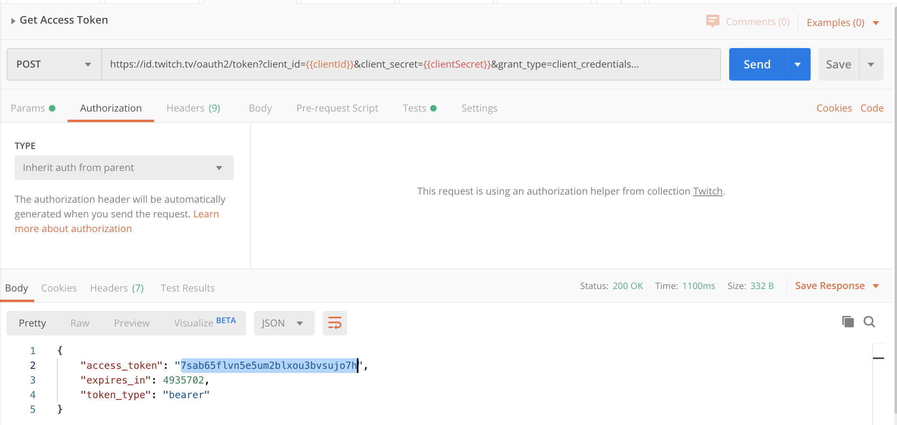
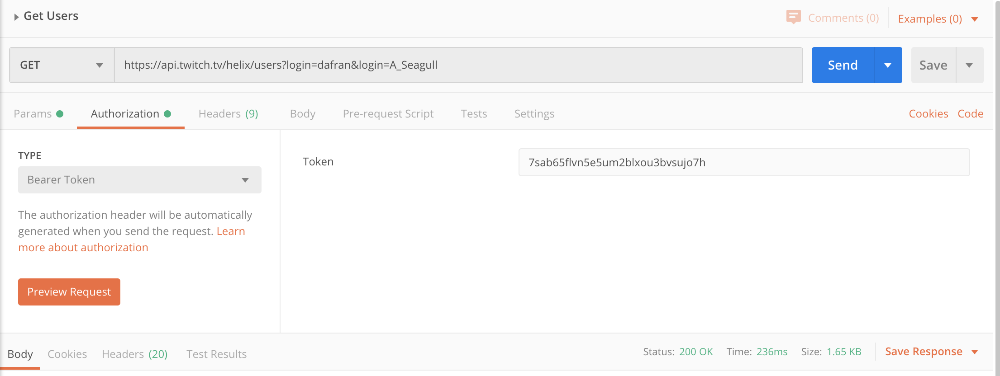
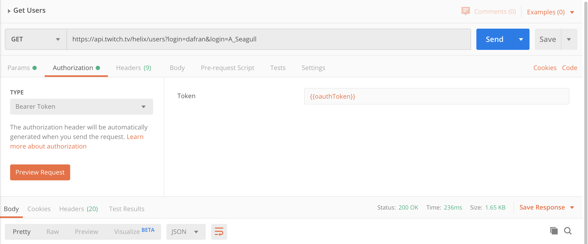

I just found out I've been heavily underusing Postman - the Postman team has baked in a [Node.js environment](https://learning.postman.com/docs/writing-scripts/intro-to-scripts/) that allows for scripting before and after requests 🤯. This provides a TON of capability within an API tool, and I want to highlight what I've been embarrasingly doing for a year + :

**1. Send a requests to grab a token or form of auth (example client creds flow[Twitch API](https://dev.twitch.tv/docs/api/))**

**2. Highlight and copy the response token**



**2. Navigate to the next request, paste the token in the appropriate location**



**3. Submit second request and get a response**

But with scripts there is a simple way to automate the process of getting a token. 

## The scripts way

In the "Tests" tab of the GET token call, we can place the following:

```javascript
var jsonData = JSON.parse(responseBody);
console.log(jsonData);
pm.globals.set("oauthToken", jsonData.access_token);
```

Snippets placed in the "Tests" tab will get run after the requests is executed, so here we are setting the global variable `oauthToken` to the key `access_token` in the response JSON we got from the client creds flow. This value is now available for use like any other environment variable in Postman with the double curly bracket syntax `{{oauthToken}}`, removing the need for the copy-paste across requests:



This small trick alone has sped up how I use Postman and there's a whole lot more you can do in these [scripts](https://learning.postman.com/docs/writing-scripts/script-references/postman-sandbox-api-reference/#scripting-workflows)... Why not use fetch in the "Pre-request Scripts" tab to completley remove the need for the first request to get the token? 