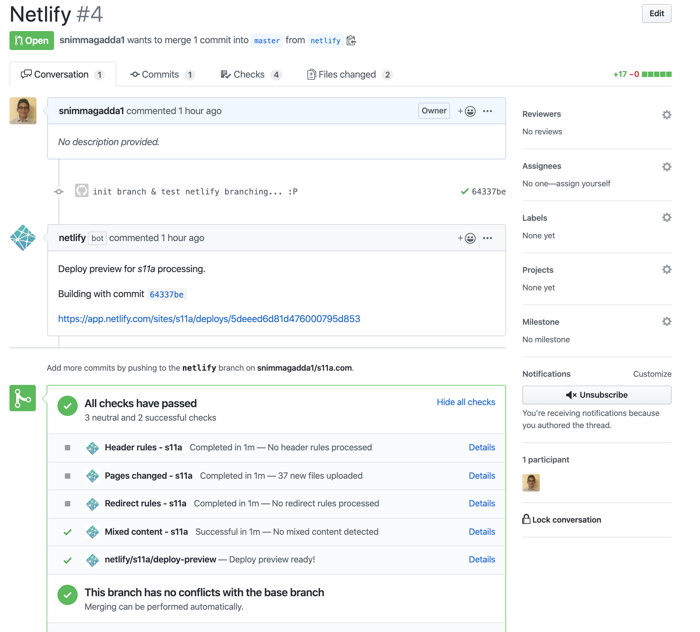

##### TL;DR: ~~Cloudfront~~ + ~~S3~~ + Route53 -> Netlify DNS

I like new things. AWS has an endless amount of cool things in its services, but site hosting in buckets just doesn't have that "shiny" new feel. My CI/CD process consisted of pushing local changes to github and running `npm run build && npm run deploy` in my terminal. I wanted more... and a robust pipeline would take a bit of groundwork to get up and running. This seemed a good enough excuse to try Netlify - **which offers this pre-configured for free**


## Getting on Netlify
I chose to follow the `New site from Git` track. After a login and a few clicks, Netlify is now aware of my site and watching with a configured build pipeline. To get my Gatsby site to deploy, I only had to update the build command the pipeline would use. I added `netlify.toml` to the root of my directory containing the following:

```yaml
[build]
  publish = "public"
  command = "npm run build"
[build.environment]
  YARN_VERSION = "1.7.0"
  ```

After, Netlify kicked off the build (since I had committed to file to master) and my site was live at http://s11a.netlify.com. CI/CD with no effort is the best kind.
  
Peeking at Netlify's settings, I saw it had some Git integrations enabled by default. I immediately enabled them all and created a PR to test. Deploy comment's and checks! Ooh ahh CI/CD:



## Route53 -> Netlify DNS
Netlify's docs are a perfect example of when minimal is too minimal IMO, but their [migration docs](https://docs.netlify.com/domains-https/netlify-dns/) do a decent enough job explaining the process for a number of migration methods. In my case, I wanted to keep AWS as my registar but use Netlify's DNS service. From reading  some of their suggested migration strategies, this seemed the easiest way to get started hosting. 

If you choose to use Netlify DNS (still in beta), there are really only a few steps to get the site up at a custom domain:

1. Add your custom domain to Netlify
2. Update AWS Route53 hosted zone (NS, SOA)
3. Update your domain's name services (if controlled by AWS)
